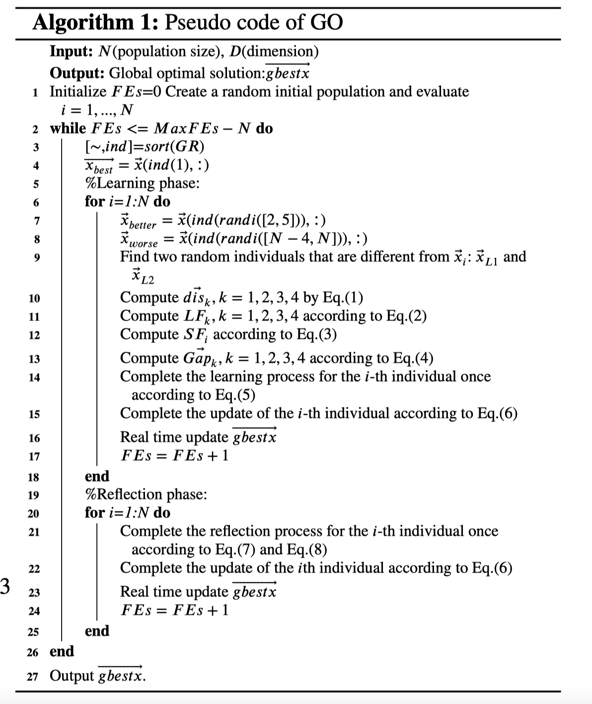

# Growth-Optimizer

## Introduction

GO is a novel and powerful meta-heuristic optimizer, named Growth Optimizer (GO), is
proposed. Its main design inspiration originates from the learning and refl ection mechanisms of
individuals in society in their growth process. Learning is the process of individuals growing up by
acquiring knowledge from the outside world. Refl ection is the process of checking the individual’s
own defi ciencies and adjusting the individual’s learning strategies to help the individual’s growth.
This work simulates this growth behavior mathematically and benchmarks the proposed algorithm on
a total of 30 international test functions of the 2017 IEEE Congress on Evolutionary Computation real-
parameter boundary constraint benchmark (CEC 2017 test suite). A total of 50 state-of-the-art meta-
heuristic algorithms participated in the comparison process. The results of the convergence accuracy
comparison and the two non-parametric statistics based on the Friedman test and the Wilcoxon
signed-rank test showed that GO provides competitive results compared to 50 state-of-the-art meta-
heuristic algorithms tested. In addition, to verify that GO has the ability to solve diff erent real-world
optimization problems, GO is applied to two diff erent types of real-world optimization problems:
the Multiple Sequence Alignment (MSA) problem based on the Hidden Markov Model (HMM) and
the multi-thresholding image segmentation problem based on Kapur’s entropy method. GO provides
more promising results compared to other meta-heuristic techniques, especially in terms of solution
quality and avoidance of local minima.


## The pseudocode of Growth Optimizer



## Search Analysis


## The MATLAB code of Go
```MATLAB
% Growth Optimizer: A powerful metaheuristic algorithm for solving different optimization problems
function [gbestX,gbestfitness,gbesthistory]= GO(popsize,dimension,xmax,xmin,MaxFEs,Func,FuncId)
FEs=0;
Fitness=Func;
x=xmin+(xmax-xmin)*unifrnd(0,1,popsize,dimension);
gbestfitness=inf;
for i=1:popsize
    fitness(i)=Fitness(x(i,:)',FuncId);
    FEs=FEs+1;
    if gbestfitness>fitness(i)
        gbestfitness=fitness(i);
        gbestX=x(i,:);
    end
    gbesthistory(FEs)=gbestfitness;
    fprintf("FEs: %d, fitness error: %e\n",FEs,gbestfitness);
end
while 1
    [~, ind]=sort(fitness);
    Best_X=x(ind(1),:);
%% Learning phase
    for i=1:popsize
        Worst_X = x(ind(randi([popsize-4,popsize])),:);
        Better_X=x(ind(randi([2,5])),:);
        random=selectID(popsize,i,2);
        L1=random(1);
        L2=random(2);
        D_value1=(Best_X-Better_X);
        D_value2=(Best_X-Worst_X);
        D_value3=(Better_X-Worst_X);
        D_value4=(x(L1,:)-x(L2,:));
        Distance1=norm(D_value1);
        Distance2=norm(D_value2);
        Distance3=norm(D_value3);
        Distance4=norm(D_value4);
        rate=Distance1+Distance2+Distance3+Distance4;
        LF1=Distance1/rate;
        LF2=Distance2/rate;
        LF3=Distance3/rate;
        LF4=Distance4/rate;
        SF=(fitness(i)/max(fitness));
        Gap1=LF1*SF*D_value1;
        Gap2=LF2*SF*D_value2;
        Gap3=LF3*SF*D_value3;
        Gap4=LF4*SF*D_value4;
        newx(i,:)=x(i,:)+Gap1+Gap2+Gap3+Gap4;
        %Clipping
        newx(i,:)=max(newx(i,:),xmin);
        newx(i,:)=min(newx(i,:),xmax);
        newfitness=Fitness(newx(i,:)',FuncId);
        FEs=FEs+1;
        %Update
        if fitness(i)>newfitness
            fitness(i)=newfitness;
            x(i,:)=newx(i,:);
        else
            if rand<0.001&&ind(i)~=1
                fitness(i)=newfitness;
                x(i,:)=newx(i,:);
            end
        end
        if gbestfitness>fitness(i)
            gbestfitness=fitness(i);
            gbestX=x(i,:);
        end
        gbesthistory(FEs)=gbestfitness;
        fprintf("FEs: %d, fitness error: %e\n",FEs,gbestfitness);
    end
    if FEs>=MaxFEs
        break;
    end
%% Reflection phase
    for i=1:popsize
        newx(i,:)=x(i,:);
        j=1;
        while j<=dimension
            if rand<0.3
                R=x(ind(randi(5)),:);
                newx(i,j) = x(i,j)+(R(:,j)-x(i,j))*unifrnd(0,1);
                if rand<(0.01+(0.1-0.01)*(1-FEs/MaxFEs))
                    newx(i,j)=xmin+(xmax-xmin)*unifrnd(0,1);
                end
            end
            j=j+1;
        end
        %Clipping
        newx(i,:)=max(newx(i,:),xmin);
        newx(i,:)=min(newx(i,:),xmax);
        newfitness=Fitness(newx(i,:)',FuncId);
        FEs=FEs+1;
        %Update
        if fitness(i)>newfitness
            fitness(i)=newfitness;
            x(i,:)=newx(i,:);
        else
            if rand<0.001&&ind(i)~=1
                fitness(i)=newfitness;
                x(i,:)=newx(i,:);
            end
        end
        if gbestfitness>fitness(i)
            gbestfitness=fitness(i);
            gbestX=x(i,:);
        end
        gbesthistory(FEs)=gbestfitness;
        fprintf("FEs: %d, fitness error: %e\n",FEs,gbestfitness);
    end
    if FEs>=MaxFEs
        break;
    end
end   

%Deal with the situation of too little or too much evaluation
if FEs<MaxFEs
    gbesthistory(FEs+1:MaxFEs)=gbestfitness;
else
    if FEs>MaxFEs
        gbesthistory(MaxFEs+1:end)=[];
    end
end

```

We are very grateful for your time on reviewing our manuscript!

